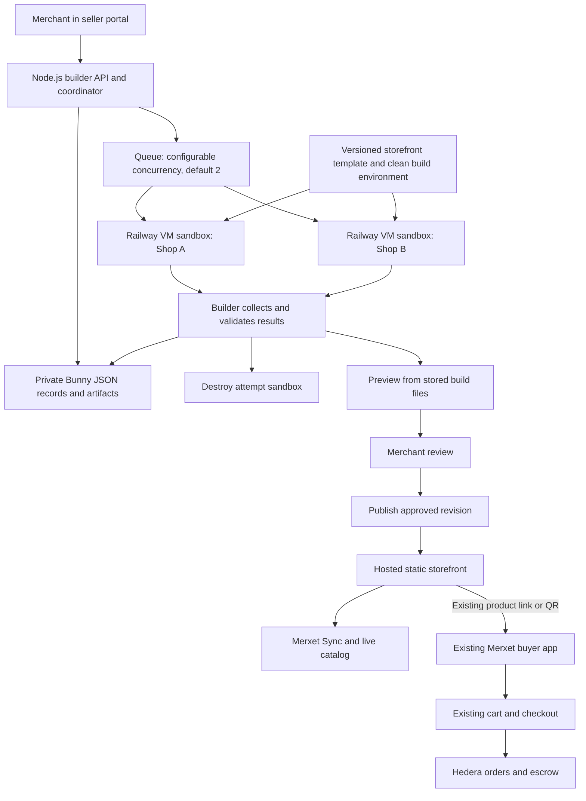

# Merxet Storefronts: Implementation Overview

Updated September 10, 2026. Phases 1–6 and `merxet-storefront-template` are implemented. The [Phase 2 harness](./tools/storefront-harness/README.md) proved isolated builds and public Bunny delivery through the deployed resolver. The [builder backend](./merxet-storefront-builder/README.md) provides internal-wallet authentication, ownership checks, durable private JSON records and the generation worker. Phase 5 adds the seller workspace, floating Design panel and private iframe/new-tab previews. Phase 6 adds durable publication, public delivery and rollback; real local Bunny publishing has been confirmed by the user. Phase 7 has deployed the builder and an isolated seller frontend, with successful deployment/HTTP checks and an exclusive replacement procedure. DNS and live HTTPS delivery checks pass; full hosted merchant/buyer acceptance remains open in [DEPLOYMENT.md](./merxet-storefront-builder/DEPLOYMENT.md). `merxet-promo` continues as the existing catalog application. See [seller setup](./merxet-storefront-builder/SELLER_WORKSPACE.md), [publication setup](./merxet-storefront-builder/PUBLISHING.md), [builder evidence](./merxet-storefront-builder/EVIDENCE.md) and [worker operations](./merxet-storefront-builder/WORKER.md).

The [implementation plan](./MERXET_STOREFRONTS_IMPLEMENTATION_PLAN.md) breaks this architecture into phased tasks, dependencies, and acceptance criteria.

Railway VM-based Sandboxes are the selected build environment. The user confirmed enabling access on September 8, 2026. The create/build/collect/destroy flow is validated in both the Phase 2 harness and the Phase 4 worker.

The product is an AI-assisted builder for individual merchant shops. A merchant selects an existing Merxet catalog, describes the desired shop, previews a generated design, requests changes, and publishes an approved revision. Shops provide branded product browsing and open selected products in the existing Merxet buyer app. The buyer app provides the cart, checkout, wallet approval, and order flow.

**Project layout.** Maintain the complete starter in `merxet-storefront-template` and the management backend in `merxet-storefront-builder`. Merchant management is in the existing seller portal; `merxet-promo` remains the catalog application. The template owns its source, lockfile, public assets, build tooling, and validation without importing sibling projects. Small pre-existing protocol/runtime helpers needed by both frontend applications remain local to each; changes to that behavior must stay compatible. There is one maintained storefront design, in the template project.

| Project | Responsibility | How it runs |
| --- | --- | --- |
| `merxet-storefront-template` (extracted) | Complete starter with protected catalog/commerce runtime, editable presentation, public configuration, versioned lockfile, fixtures, and generation instructions. | Independent development, build, and tests. Copies run in disposable sandboxes; each approved revision produces static website files. |
| `merxet-storefront-builder` | Ownership, durable metadata, queued generation, isolated build attempts, immutable private revisions, private previews, publication, public delivery and rollback. | Deployed Node.js/TypeScript backend in `Merxet/storefront-builds`, with one active coordinator, required volume and configurable VM concurrency. Separate API, preview and public listeners; custom delivery DNS and HTTPS health checks pass. |

A generated shop starts from a pinned version of `merxet-storefront-template`. The agent customizes a copy in its own sandbox workspace, and the builder stores the resulting source and static files as a shop revision on Bunny. Generated revisions are artifacts, not additional maintained repositories or permanent application servers. Generation never edits the clean starter or another merchant workspace.

**Relationship to existing projects.** Phase 1 first established the storefront in promo. The standalone extraction moves its presentation, protected runtime, generation contract, and checks into `merxet-storefront-template`. The promo project retains its existing catalog URLs, flipbook/swipe layouts, and separate regression checks.

| Existing project | Planned involvement |
| --- | --- |
| `merxet-seller` | Add a Storefront area: choose a catalog, enter a design brief, generate, inspect progress, preview, revise, publish, and view revision history. |
| `merxet-promo` | Existing browsing application with its current catalog URLs and flipbook/swipe layouts. Storefront generation uses the separate template project. |
| `merxet-frontend` | Existing buyer application: open a product using its current link format, let the buyer add it to the cart, and handle checkout, wallet approval, encryption, and orders. No new cart receiver or checkout implementation is planned. |
| `merxet-sync` | Continue resolving Hedera catalog identity and catalog URLs. Add narrow read support only where the storefront requires it. |
| `merxet-order-protocol` | Reuse applicable identifiers and data definitions. The storefront does not introduce a new order or cart-handoff protocol. |
| `merxet-smartcontract` | Existing source of catalog ownership and order settlement. No contract migration is planned for the browsing and generation milestone. |
| `merxet-mcp`, `merxet-x402-server` | Existing capabilities outside the new generation workflow. Preserve compatibility with existing catalogs. |

The current promo app resolves a catalog from its seed and links individual products to the buyer app. Its QR format contains catalog, product, and network identifiers. The buyer app already decodes those identifiers and opens the matching product details page. Reuse this exact entry flow. Relevant source: [promo catalog client](./merxet-promo/src/lib/syncService.ts), [product links and QR display](./merxet-promo/src/components/ProductPageMobile.tsx), [product link format](./merxet-promo/src/lib/qrCodeUtils.ts), and [buyer link receiver](./merxet-frontend/src/components/UrlParserAndRedirector.tsx).

**Overall flow.** The builder generates and publishes a shop; public browsing and checkout continue working after the generation job has finished.

**Storefront data and ownership.** Give each shop a stable ID, network, owner wallet, display name, catalog reference, and published revision. Keep storefront identity separate from its current generated design. The builder verifies wallet ownership for creation, editing, generation, and publication, including that the merchant controls the linked catalog.

Use the seller's operational internal wallet for initial authentication: sign a single-use login challenge, verify the signature and account binding on the builder, then establish a management session. HashPack and other external-wallet authentication are deferred. Wallet connection alone does not authenticate requests to the builder.

Start with one existing catalog per shop. Collections can group products within that catalog. Scope storefront product references by network, catalog, and product ID so each link opens the intended product. Multiple catalogs can follow as a browsing extension; payment and cart rules belong to the buyer application.

Store each revision's parent revision, merchant prompt, public catalog snapshot reference, template version, source archive, build result, and preview location. Record generation jobs and publication selection separately from completed revisions so a failed or canceled attempt cannot replace the live shop. Use JSON documents in Bunny Storage for metadata, alongside stored source, images, logs, and built websites. The initial implementation does not require a SQL database.

**Metadata and artifact storage.** Keep management records, prompts, source archives, and build logs in a private Bunny storage zone. Publish only approved website files and public assets through a separate zone connected to a CDN Pull Zone. Access private previews through the builder's authenticated preview flow on a separate origin.

Store complete versioned metadata records inside immutable `operations/<sequence>-<id>/operation.json` documents, each followed by a verified `commit.json` marker. This preserves changes and their original request results together, including multi-record authentication and revision-completion operations. Shop records contain ownership, catalog binding, configuration, selected draft and published revision; revision manifests reference private artifacts under network/owner/shop paths. Startup validates committed history and rebuilds owner-scoped records, listing caches and retry receipts. There is no mutable global listing file.

Run one active coordinator that serializes changes to each shop and its job records. Sandbox attempts report results through that coordinator instead of independently updating shop metadata. Persist an accepted job before acknowledging it. Persist attempt identity, sandbox ID, command session IDs where available, deadlines, and cleanup state as the attempt progresses. On restart, reconcile unfinished records with their known sandboxes before scheduling replacement work. Deployments must stop the previous coordinator before enabling writes in its replacement. A local lock cannot coordinate multiple active service replicas. Serializing metadata writes still permits different shops to build concurrently.

Use authenticated reads from the storage zone's primary endpoint for editing and publication decisions, rather than cached CDN responses. Bunny's HTTP documentation describes file upload, download, and directory listing, but does not establish conditional overwrite guarantees; do not assume database-style transactions or compare-and-swap writes. Validate overwrite visibility and interrupted-upload recovery in the storage prototype. If multiple independent coordinators become necessary, revisit the coordination mechanism or database choice. [Bunny HTTP storage documentation](https://bunny.net/docs/storage/http)

Upload and verify a revision's complete artifacts before writing its completed manifest or selecting it for publication. Preserve completed revisions and make publication retries safe for the same revision. Backups and retention management are deferred; this milestone keeps stored revisions available for rollback and adds no artifact retention cleanup. Worker disk is temporary workspace; records and artifacts required after a restart belong in Bunny Storage. Build sandbox cleanup remains part of the worker lifecycle.

**The template and agent contract.** Use the completed Phase 1 starter in `merxet-storefront-template`. Its catalog loading, exact price formatting, buyer-app links, QR codes, and loading/error behavior are maintained runtime code. AI may customize the prepared pages, sections, and styles for merchant branding. The template includes a homepage, collections, product grids, details, responsive navigation, and initial HTML/share metadata. Keep its toolchain and lockfile fixed for reproducible generated builds.

The [template specification](./MERXET_STOREFRONT_TEMPLATE_SPEC.md) describes package choices, page components, public configuration, editable source boundaries, hosting requirements, and validation.

Here, "template" means the complete, versioned `merxet-storefront-template` project. Its own folder makes the sandbox input explicit and independently buildable. Each merchant receives a source copy; only that copy is customized. Do not maintain another starter copy in `merxet-promo`.

The agent receives the merchant's brief, public catalog data, supplied branding assets, template source, and instructions identifying editable presentation files. It can change layout code, styles, section composition, and shop copy grounded in the supplied information. The initial generation contract keeps dependency versions, build commands, catalog identity, and buyer-app link generation under platform control. Validate changed paths and dependency manifests before accepting an output.

Product cards bind to catalog IDs and load current names, descriptions, images, prices, and assets. A generation-time snapshot helps the agent design the shop; it is not the live pricing source. Price changes should appear without regenerating the design, subject to a defined cache refresh policy. Removed products must become unavailable, and new products appear through the shop's live catalog listing. Featured sections retain explicit product references.

**Buyer-app entry.** Each product offers an ordinary link to the existing buyer app and a QR representation of the same URL. Reuse the promo helper that combines the catalog seed, product ID, and network into the buyer app's supported URL fragment. The buyer application opens the product details page, where the customer chooses quantity, adds it to the existing cart, and completes checkout.

The storefront displays products and directs buyers to that flow. It does not maintain a second basket, transmit a cart payload, collect delivery details, connect a payment wallet, or create orders. No cart-handoff API, temporary cart storage, or new buyer-app route is required. Acceptance checks should confirm that generated links use the configured official buyer-app origin and resolve the correct product and network.

**Generation and preview.** Implement generation as a background job: queued, provisioning, generating, building, validating, uploading, ready, failed, or canceled. The seller portal should show progress, allow cancellation, and preserve the last usable revision when a job fails. A revision request should start from the selected draft, retaining its catalog binding and version history. Each retry gets a new attempt ID and sandbox; only the currently accepted attempt can produce the job's ready revision.

The agreed Phase 5 workspace belongs in `merxet-seller`. A compact fixed header provides navigation back to Storefronts, the shop name, revision selection, Desktop/Mobile preview widths, Open preview in new tab and a Design panel toggle. Keep seller navigation/account access available without duplicating tall headers. The main canvas contains an interactive iframe, with a Design panel initially floating near its lower-left. The panel holds request history, progress and the design prompt; drag it by its title bar within the visible workspace or collapse it to a compact Design button with an active-job indicator. Remember placement and collapse preferences locally, offer Reset position, and keep controls reachable after resizing. On mobile, use a collapsible bottom sheet. Panel interactions must preserve the iframe's route/scroll, prompt text and job tracking.

Before the first build, present the catalog and brief with **Generate storefront** and a preview placeholder. Subsequent requests show **Based on Draft N** and **Generate revision**, including when an older revision is selected. Keep the current preview usable during generation, report real progress in plain language, and add **Draft N ready — View** to history when a revision is available. Show failures inline with Retry. Restore jobs and revision history from durable records after reload; local panel preferences are UI state only. Phase 6 adds explicit publication and rollback controls with confirmation and durable progress.

The iframe loads the selected revision's compiled static website from private Bunny artifacts through a separate preview listener/origin. The workspace header and panel stay outside it. Phase 5 uses short-lived bearer preview grants scoped to one owned ready revision; each HTML, direct route, configuration and asset request is authenticated with that grant and verified against the revision manifest. Possession of the preview URL grants temporary read access to that revision. Management and wallet credentials remain outside generated code. No cookies or public shared caching are used. Grant expiry, session revocation, key rotation or a coordinator restart invalidates the link; the workspace can request a fresh grant for the durable revision. Response-level sandbox/CSP policies preserve isolation in new tabs too. Neither preview mode depends on the build VM remaining alive. Desktop/Mobile controls test responsive layout by changing the iframe viewport width.

The agent/model remains selectable after the template-generation trial. Keep model requests and credentials in the trusted builder, and route workspace edits and code execution through a Railway sandbox adapter. Treat catalog descriptions as input data rather than agent instructions. Keep Railway management, Bunny, wallet, and deployment credentials out of generated source and sandboxes; the builder alone controls storage and publication. Serve generated previews and shops on origins that do not receive seller-portal or buyer-wallet credentials.

**Railway sandbox execution.** Integrate Railway's TypeScript SDK in the builder backend behind a small adapter for creating sandboxes, transferring files, running commands, inspecting results, and destroying sandboxes. Scope every operation to the configured Railway environment and the attempt's explicit sandbox ID. If the CLI is used for the prototype, always specify the sandbox ID rather than relying on its shared active-sandbox setting. [Railway Sandboxes](https://docs.railway.com/sandboxes), [Railway sandbox CLI](https://docs.railway.com/cli/sandbox).

Prepare a clean, versioned Railway template or checkpoint with Node.js, the storefront template dependency lockfile, installed dependencies, and browser-check tooling. Key the environment version to the toolchain and lockfile. Each attempt starts from that clean base and receives only its own source, public catalog snapshot, and supplied assets. Merchant workspaces must never become the shared base for subsequent jobs. The sandbox base is a build cache; durable shop source and results remain in Bunny.

Make concurrency configurable through `MAX_CONCURRENT_BUILDS=2` and `MAX_CONCURRENT_BUILDS_PER_SHOP=1` as proposed startup defaults. The global limit applies across all merchants and can be increased; two is not an architectural maximum. Additional requests remain queued. The coordinator owns these limits, including provisioning, result collection, and cleanup; it does not release a slot for reuse while the old sandbox is still running. Use configurable command timeouts, an overall attempt deadline, output-size limits, and a bounded retry count. Establish concrete time and output budgets during the template trial, and check which VM resource controls the current Railway interface exposes before assigning CPU/memory settings.

Use Railway's `ISOLATED` network mode with no access to the project's private services. This mode still allows outbound internet traffic. The builder supplies inputs and retrieves outputs through the files API. Configure the provider idle timeout within the account's allowed range and maintain the required interaction during long jobs; a running process alone does not prevent idle destruction. Explicit command and attempt deadlines remain separate from that idle timeout. [Railway networking and timeout behavior](https://docs.railway.com/sandboxes#networking).

For each attempt, create the sandbox, record its identity, apply the source changes, run the fixed type/lint/build checks, then run browser validation inside the sandbox. Inspect command exit codes, timeout status, and output truncation explicitly. The build process creates `dist/`; the builder then retrieves bounded source/build archives and logs, validates their paths and sizes, uploads them to Bunny, and records the completed revision. A sandbox result cannot select the published revision.

Always attempt sandbox destruction after success, failure, timeout, or cancellation. Retain unfinished cleanup records and reconcile builder-owned orphan sandboxes after restarts, including the case where creation succeeded before its ID was saved. Track that ownership through provider metadata or a dedicated execution environment; never clean up unrelated Railway sandboxes. Reattach to a recorded command only when its attempt is still current; otherwise terminate it before retrying. Duplicate requests and late results must not create another accepted revision or overwrite newer work.

Before presenting a ready draft, run the build and focused browser checks for mobile layout, catalog rendering, product navigation, and buyer-app links/QR codes. Build success alone does not demonstrate a working shop. Preserve failure evidence and allow a bounded repair attempt or a fresh merchant revision.

Railway sandboxes do not provide a public website endpoint. The seller's preview therefore uses collected static artifacts from Bunny through the authenticated preview service. After collection, the sandbox can be destroyed while the merchant continues reviewing the draft. [Railway sandbox connectivity](https://docs.railway.com/sandboxes#reaching-a-port-in-a-sandbox).

**Hosting and publishing.** Publish static builds to shared Merxet hosting backed by Bunny Storage and CDN. Keep each validated build immutable and map a stable shop address to the selected published revision. The validated resolver reads selection metadata from authenticated primary storage and serves verified compiled bytes from Bunny CDN. HTML and configuration use `no-store`; immutable asset references preserve files required by older pages and allow a one-year browser cache. Changed assets, including branding images, require new filenames. Publication and rollback update selection only after artifact verification; no cached selection needs a CDN purge in this prototype. A generation worker cannot publish its own output.

The template's asset paths and page routing must support its chosen deployment URL, including direct links to product pages. Vite provides static build output and configurable deployment paths; use a static host for public shops. Its preview server is intended for local build inspection. [Vite deployment documentation](https://vite.dev/guide/static-deploy.html)

Static website and source downloads are outside the implementation scope. Private source artifacts remain part of the builder's revision workflow. Custom-domain automation and independent hosting remain later extensions.

**Delivery sequence.** Extend the promo application into a customizable shop, prove agent customization of a source copy, then add the automated builder around it.

| Phase | Work | Completion evidence |
| --- | --- | --- |
| 1. Prepare promo for storefronts | Define shop metadata, separate promo catalog loading from presentation, and add merchant branding and a shop layout. Preserve price display and buyer-app links. | Responsive shop with live products; existing promo URLs still work; a link or QR opens the correct product in the existing buyer app. |
| 2. Sandbox and agent feasibility | Extract the complete starter into its own project, then prepare the clean Railway build environment. Create a sandbox, customize the template for a catalog and brief, build and validate it, collect artifacts, and destroy the sandbox. Repeat for a second merchant. | Two distinct designs pass the same checks; files belong to the intended attempt; artifacts remain available after sandbox destruction. This determines the initial model choice and build budgets. |
| 3. Merchant builder | Add Bunny JSON job/attempt/revision records, the single coordinator and configurable queue, Railway sandbox lifecycle integration, and the seller portal's prompt/preview/revise interface. | With default limits, two different shops can build concurrently, a third queues, and same-shop requests serialize. Changing the configured limits changes capacity. Failure, cancellation, duplicate requests, restart recovery, and cleanup preserve previous work. |
| 4. Publication | Add stable hosted addresses, explicit revision publication, rollback, and seller publication controls. | An approved shop is reachable publicly; a failed revision leaves it intact; rollback restores a previous build. |
| 5. End-to-end validation | Check cross-merchant isolation, current catalog data, direct links, existing catalog/QR compatibility, and a purchase through the existing buyer app. Record the new work for Continuity. | Two separately owned, differently branded shops work on desktop and at 390x844. A selected product opens in the buyer app and follows its existing cart, payment, and order flow. |

Phases 1–6 are implemented, including the deployed public delivery prototype, independent builder/worker, seller workspace with private previews, and managed publication/rollback. Phase 7 has deployed the builder and an isolated seller frontend; DNS and live delivery checks pass; complete hosted acceptance remains outstanding. The maintained layout includes the extracted template, `tools/storefront-harness` with its resolver prototype, the isolated `tools/storefront-ui-smoke` checks, and `merxet-storefront-builder` alongside the existing seller and promo applications. Local setup and manual checks are in [SELLER_WORKSPACE.md](./merxet-storefront-builder/SELLER_WORKSPACE.md) and [PUBLISHING.md](./merxet-storefront-builder/PUBLISHING.md); deployment and live acceptance are in [DEPLOYMENT.md](./merxet-storefront-builder/DEPLOYMENT.md).

**Scope boundary.** World Selfie Check, ENS, a shared marketplace, automated custom domains, fully independent backend hosting, product variants, inventory reservations, and new MCP functionality are later extensions. Keep a stable shop identity so future verification and naming integrations can attach to it. A storefront cart and replacement checkout are not part of this plan; purchases use the existing buyer application.

**Foundation decisions.** Public delivery at `/s/<shopId>/`, its cache behavior and private/public Bunny storage are verified. Builder metadata uses immutable JSON operations and verified completion markers; startup rebuilds records and retry caches. Authentication supports the current internal-wallet EIP-191 contract and stores session token hashes. Stop and drain the single coordinator before starting its replacement; automated recovery, backup and retention rules remain later work. The Railway execution environment, clean checkpoint, SDK version, selected `gpt-5.6-luna` model, measured pilot budgets and cleanup ownership are recorded in the Phase 2 harness. The buyer-app URL format is reused as-is.
