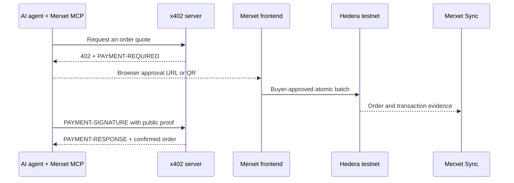

# Merxet x402 Server

The Merxet x402 server turns an agent-prepared shopping request into a
short-lived, signed payment requirement for a real Hedera testnet order. It
implements a custom client-settled x402 v2 scheme: the buyer approves the
payment in the official Merxet frontend, and the server confirms the purchase
only after matching it to public Hedera settlement evidence.

[Watch the agentic shopping flow demo](https://www.youtube.com/watch?v=8yIsOfNCYDs)

## Role in the agentic shopping flow



The server does not broadcast a payment or control a wallet. It provides the
x402 negotiation and verification layer around Merxet's existing
browser-approved Hedera escrow flow.

## What it does

- Resolves products and prices from the seller's authoritative catalog.
- Creates a ten-minute quote for HBAR or supported HTS assets.
- Signs the quote digest with an Ed25519 key.
- Returns x402 v2 `PAYMENT-REQUIRED` data using the `merxet-order` scheme.
- Stores the signed quote and encrypted delivery envelope in Redis for
  cross-instance recovery.
- Verifies the buyer, payer, catalog, contract, asset, amount, and successful
  outer `ATOMICBATCH` before confirming settlement.
- Returns a standard x402 `PAYMENT-RESPONSE` header with the verified Hedera
  transaction.

## HTTP API

| Method | Endpoint | Purpose |
| --- | --- | --- |
| `GET` | `/healthz` | Confirms that the service and quote store are available |
| `POST` | `/api/v1/testnet/order-quotes` | Validates an encrypted order request and returns `402 Payment Required` |
| `POST` | `/api/v1/testnet/order-quotes/resolve` | Resolves an unexpired signed quote by `orderSeed` for the trusted frontend |
| `POST` | `/api/v1/testnet/orders/:orderSeed/confirm` | Validates `PAYMENT-SIGNATURE` against public Hedera evidence and returns `PAYMENT-RESPONSE` |

### Quote creation

The quote endpoint accepts:

- A unique order seed.
- A catalog seed.
- Product IDs and quantities.
- An AES-256-GCM encrypted delivery envelope.
- A transient delivery key used to validate and price the request.

Prices, seller identity, contract details, and payment assets are resolved
from authoritative Merxet catalog data. The client cannot provide its own
price.

### Settlement confirmation

The confirmation endpoint does not accept transaction bytes or a wallet
signature. Its `PAYMENT-SIGNATURE` header carries the selected x402
requirements plus the public Hedera transaction and buyer account IDs.

Confirmation succeeds only when Merxet Sync supplies matching evidence for a
successful outer `ATOMICBATCH`. If indexing is still in progress, the server
returns `503 proof_pending` with a `Retry-After` header.

## Privacy and security

- Wallet approval and transaction signing happen only in the official Merxet
  frontend.
- The x402 server never receives a wallet password, mnemonic, private key, or
  generic transaction-signing capability.
- Delivery data is encrypted before the quote request. The server uses the
  supplied key transiently for validation, then removes it from the request
  object and does not persist it.
- Redis stores the signed quote and encrypted delivery envelope, never the
  delivery key or plaintext delivery details.
- Catalog downloads are restricted to configured HTTPS origins, checked
  against private destinations, redirect-limited, and size-bounded.
- Quote records are created atomically with Redis `SET NX`, preventing reuse of
  an existing order seed.
- Production deployments require Redis; the in-memory store is intended only
  for local development and tests.

## Requirements

- Node.js 22 or later
- A reachable Merxet Sync service
- Redis for production
- An Ed25519 quote-signing key pair

## Configuration

| Variable | Required | Description |
| --- | --- | --- |
| `PORT` | No | HTTP port; defaults to `3402` |
| `NODE_ENV` | No | Runtime environment; defaults to `development` |
| `MERXET_SYNC_ORIGIN` | Yes | Bare origin of the Merxet Sync service |
| `MERXET_RESOURCE_ORIGIN` | Yes | Bare public origin of this x402 service |
| `MERXET_CATALOG_ORIGINS` | Yes | Comma-separated allowlist of catalog HTTPS origins |
| `MERXET_QUOTE_SIGNING_KID` | Yes | Identifier for the active quote-signing key |
| `MERXET_QUOTE_SIGNING_KEY_PKCS8` | Yes | Ed25519 private key in PKCS#8 PEM format |
| `MERXET_QUOTE_PUBLIC_KEY` | Yes | Active Ed25519 public key as unpadded Base64URL |
| `MERXET_QUOTE_PUBLIC_KEYS` | No | JSON object containing additional `kid` to public-key mappings for rotation |
| `MERXET_REDIS_URL` | Production | Redis connection URL; defaults to `memory://` outside production |
| `MERXET_CORS_ORIGINS` | No | Comma-separated browser origins; an empty value allows any origin |
| `MERXET_CATALOG_MAX_BYTES` | No | Maximum catalog response size; defaults to `1048576` |
| `MERXET_RECOVERY_SECONDS` | No | Post-expiry settlement recovery window; defaults to `86400` |
| `MERXET_SYNC_RETRY_SECONDS` | No | Suggested retry delay while evidence is pending; defaults to `5` |

All configured service origins must be bare HTTPS origins. `localhost` and
`127.0.0.1` may use HTTP for local development.

## Local development

Install dependencies and generate a development quote-signing key:

```powershell
npm install
npm run generate-quote-key
```

Set the required environment variables using the generated key values, then
start the development server:

```powershell
npm run dev
```

Check service and quote-store health:

```powershell
curl http://localhost:3402/healthz
```

Run the automated tests and production build:

```powershell
npm test
npm run build
```

## Key rotation

Deploy the new public key to the Merxet frontend before the server begins
signing quotes with it. During the transition, retain previous keys in
`MERXET_QUOTE_PUBLIC_KEYS` until every quote signed by an older key has passed
its recovery deadline.

## Related components

- `@merxet/mcp` prepares encrypted order requests and tracks settlement.
- `@merxet/order-protocol` defines the shared schemas, encryption, quote
  signatures, and x402 header codecs.
- Merxet frontend verifies the quote and performs wallet approval.
- Merxet Sync correlates the order with its successful Hedera atomic batch.
